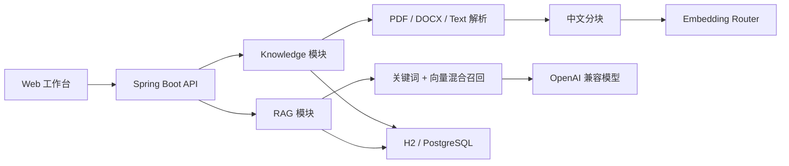

# 架构说明

JadeBase 第一阶段采用模块化单体。它保留清晰的领域边界，同时避免在产品闭环尚未验证前引入分布式复杂度。

## 模块边界

| 模块 | 职责 |
| --- | --- |
| `knowledge` | 知识库、文档生命周期、文本提取、分块和索引 |
| `rag` | 向量生成、混合召回、上下文构造、模型调用和引用 |
| `common` | 错误处理、初始化数据等横切能力 |

## 检索策略

默认召回分数为：`0.65 × cosine_similarity + 0.35 × keyword_overlap`。

本地演示模式使用 384 维字符 n-gram 哈希向量，对中文无需额外分词服务。生产环境配置 Embedding 接口后，索引和查询会路由到远程模型。更换 Embedding 模型后应重新索引已有文档。

第一阶段在应用内计算向量相似度，适合验证和小型知识库。第二阶段将向量列迁移至 pgvector，并加入异步索引任务、重排模型和权限过滤。

## 模型适配

聊天和 Embedding 均通过 OpenAI 兼容协议接入，两个端点可以独立配置。回答提示词要求模型只依据召回资料作答，并使用 `[资料N]` 标记引用。

## 已知边界

- 文档索引当前为同步操作。
- 大型知识库尚未使用数据库侧向量索引。
- 第一阶段不包含租户、SSO、细粒度文档权限和连接器。
- 扫描版 PDF 尚未接入 OCR。
