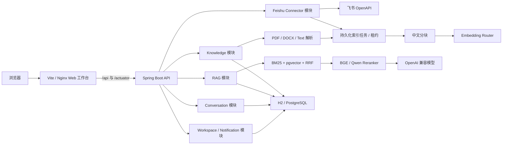

# 架构说明

JadeBase 第一阶段采用模块化单体。它保留清晰的领域边界，同时避免在产品闭环尚未验证前引入分布式复杂度。

前端位于仓库根目录 `frontend/`，独立安装、开发和构建。开发环境由 Vite 将同源接口请求
代理到后端；Docker Compose 中由 Nginx 提供静态资源并代理 REST、Actuator 与 SSE。
Spring Boot 只负责 API 和领域逻辑，不再打包浏览器资源。

## 模块边界

| 模块 | 职责 |
| --- | --- |
| `knowledge` | 知识库、文档生命周期、文本提取、分块和索引 |
| `rag` | 向量生成、BM25、RRF、重排、Query Rewrite、模型调用和引用 |
| `evaluation` | RAG 黄金集执行、Recall@K、MRR、术语覆盖率和延迟报告 |
| `conversation` | 会话、消息及引用快照持久化与历史检索 |
| `workspace` | 单工作区资料、外观和回答偏好 |
| `notification` | 系统通知与已读状态 |
| `connector.feishu` | 飞书凭证、内容发现、持久化同步任务、增量映射和退避恢复 |
| `common` | 错误处理、初始化数据等横切能力 |

## 检索策略

向量和 BM25 各自召回候选后使用 Reciprocal Rank Fusion 合并：
`score = Σ 1 / (rrfK + rank)`，默认 `rrfK=60`。融合后的候选可发送到 BGE 或
Qwen 兼容的 `/v1/rerank` 接口；重排服务不可用时自动降级到 RRF 排序。

本地演示模式使用 384 维字符 n-gram 哈希向量，对中文无需额外分词服务。生产环境配置 Embedding 接口后，索引和查询会路由到远程模型。更换 Embedding 模型后应重新索引已有文档。

本地模式在 JVM 中执行余弦检索和中文 BM25，适合零依赖演示。Docker Compose 模式使用
PostgreSQL：384 维向量写入 pgvector 并由 HNSW 检索；分词结果持久化到
`document_chunk_terms`，由数据库计算 BM25。两种实现共享相同接口和 RRF 策略。

## 模型适配

聊天和 Embedding 均通过 OpenAI 兼容协议接入，两个端点可以独立配置。回答提示词要求模型只依据召回资料作答，并使用 `[资料N]` 标记引用。

## 异步索引

上传接口在同一事务中保存文档、原始文件和 `document_index_tasks` 记录。Worker 使用数据库
悲观锁领取任务，并通过 `lease_until` 续租；应用退出后，超时租约会自动回到队列。
分块生成完成后一次性替换旧索引，避免重建失败破坏原有检索结果。进度通过 SSE 推送，
前端在断线时回退到轮询。原始文件持续保留，以支持模型变更后的重新索引。

## 评测与可观测性

`POST /api/v1/evaluations` 执行不调用生成模型的检索评测，输出 Recall@K、MRR、期望术语
覆盖率和延迟。聊天响应附带向量候选数、BM25 候选数、融合候选数、是否重排和检索耗时。
Actuator 暴露索引、检索、评测、Reranker 降级和 Query Rewrite 降级指标。

## 飞书连接器

飞书企业自建应用凭证使用 AES-GCM 加密后写入数据库。同步任务以数据库租约领取，游标在每个
远程分页完成后持久化；Worker 中断时从最近游标继续。远程文档以来源 ID 和文档 token 唯一
定位，revision 与正文 SHA-256 均未变化时只更新标题、位置和来源元数据。完整遍历成功后才会
删除本轮未发现的文档，因此限流、权限或网络失败不会误删本地索引。

连接器任务状态和计数可在设置页与 `/api/v1/connectors/feishu/sync-tasks` 查看；Prometheus
暴露 `jadebase_connector_sync_duration_seconds`、`jadebase_connector_sync_completed_total`
和 `jadebase_connector_documents_total`。

## 已知边界

- 当前不包含多租户、SSO 和飞书源权限继承。
- 扫描版 PDF 尚未接入 OCR。
- 飞书连接器当前索引新版 Docx 正文；Sheet、Bitable、旧版 Doc 和附件会计入跳过数。
- pgvector 当前固定为 384 维，更换 Embedding 模型需要保持维度一致并重新索引。
